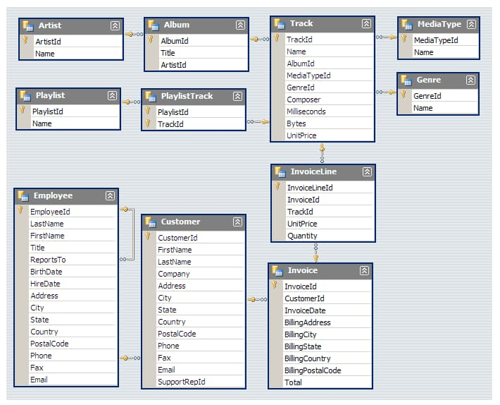

# MUSIC_STORE_ANALYSIS

This project explores a music store's PostgreSQL database to extract **actionable business insights** using SQL. It includes a full database backup, an ERD (Entity Relationship Diagram), and a collection of SQL queries answering real-world analytical questions.

---

## 🗂️ Project Structure

| File Name             | Description |
|-----------------------|-------------|
| `MUSIC_DATA.sql`      | 🎯 Full SQL database |
| `MUSIC_QUERIES.sql`   | 📊 Analytical SQL queries covering 11 business use-cases |
| `MUSIC_STORE_MODEL.jpg` | 🧠 Entity Relationship Diagram (ERD) of the database |
| `README.md`           | 📘 Project overview and usage instructions |

---

## 🧠 Business Questions Answered

1. **Who is the senior-most employee?**  
2. **Which countries have the most invoices?**  
3. **What are the top 3 invoice totals?**  
4. **Which city has the best customers (by revenue)?**  
5. **Who is the top spending customer?**  
6. **Who are the Rock music listeners (emails)?**  
7. **Top 10 Rock artists by number of tracks**  
8. **Tracks longer than the average duration**  
9. **Spending by each customer on each artist**  
10. **Most popular genre per country**  
11. **Top customer per country by total spending**

These queries use:
- `JOIN`, `GROUP BY`, `ORDER BY`
- Aggregate functions (`SUM`, `COUNT`, `AVG`)
- Subqueries
- Common Table Expressions (CTEs)
- Window Functions (`ROW_NUMBER()` with `PARTITION BY`)

---

## 🧾 Database Overview

The database models a digital music store and includes tables such as:

- `customer`, `employee`, `invoice`, `invoice_line`
- `track`, `album`, `artist`, `genre`

Each invoice represents a customer purchase and links to one or more tracks. Tracks belong to albums, and albums are created by artists and categorized into genres.

📌 **Entity Relationship Diagram (ERD):**

---
